# 嘉立创

## 注册账号

我们需要用到以下几个网站和软件。

### 立创开源硬件平台

[立创开源硬件平台]: https://oshwhub.com/

------

### 立创商城

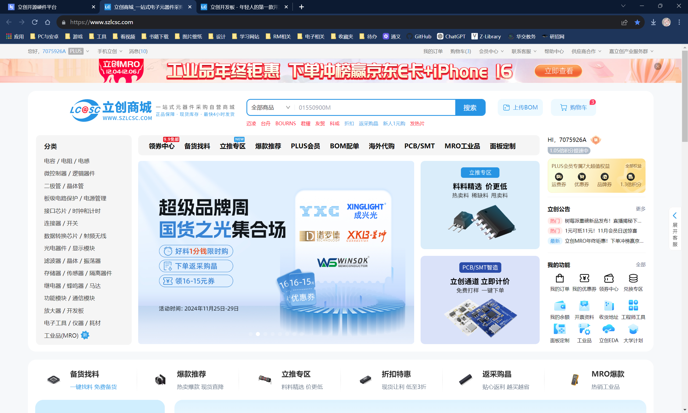

[立创商城]: https://www.szlcsc.com/

------

### 立创开发板

[立创开发板]: https://lckfb.com/

------

### 立创EDA

[立创EDA下载页]: https://lceda.cn/page/download?src=index

------

#### 软件页面

------

### 嘉立创下单助手

------

嘉立创集团下所有网站和应用账号通用，所以只需要在一个页面下注册账号即可。

## 优惠券领取

### 立创商城优惠券

在立创商城-上方会员中心-我的优惠券，该页面下领取优惠券。

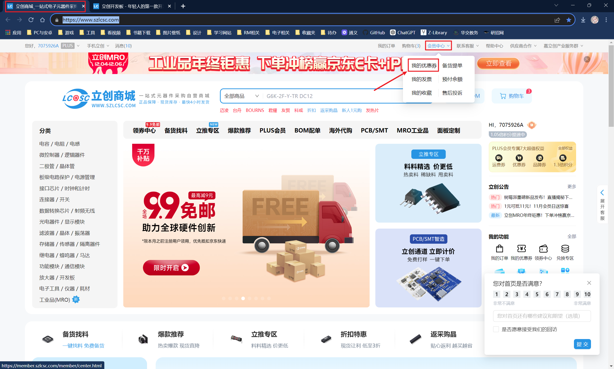

------

------

这两张券的使用日期是11月29日。

------

### PCB打样券

在嘉立创下单助手中。

------

每月可领取两张打样券。（打样面积10cm*10cm）

------

## 购买开发板

购买芯片要小心！在不知名小店购买容易买到假芯片！

（疫情时期该现象极为严重，虽说现在情况好很多但还是要小心，购买芯片之类的要在知名商铺）

回到立创开发板页面。

图中框选的开发板为可选择。

**蓝色**部分是可用Arduino系开发，操作简单适合入门（有Arduino和ESP32）。

**红色**是推荐使用（都是STM32）。

**黑色**是进阶使用（Linux开发板）。

页面有MSP系列的开发板，是Texas Instruments （德州仪器），有时电赛会有某些题要指定使用TI芯片。

还有很多的CW32、GD32等，那些是国产芯片，初学者暂不推荐购买，资料没有STM32多。

------

在这里我说明一下，我们要求使用的开发板是STM32，型号不用统一，但是推荐你们使用STM32F103C8T6，即图中的 `立创·地阔星`开发板（左下角），在网上能搜到大量的F103的教程。

### 购买流程

#### 第一步点购买，不用教吧

------

#### 第二步，如果你是初次购买，需要完善信息。（待会再讲）

------

#### 第三步，选择快递和使用优惠券。

------

在这里买STM32F103大概7块。

### 第二步特别说明

初次购买立创的商品和打样PCB都要完善个人信息。

------

------

开票主体选个人，填自己名字。

## 烧录器

直接购买STM32的开发板是没有烧录器的，这个也要自己单独购买。市面上STM32烧录器有：

1. ST-Link         （意法半导体自家的产品）
2. DAP-Link      （由ARM公司开源的烧录器）
3. JLink              （SEGGER公司开发的调试器）
4. ULink              （好像是KEIL公司自己的）
5. ...

这些产品各有优点。淘宝上能买到较为便宜的 应该是ST link ，DAP-Link后面会用到很多的无线的调试器。JLink的数据传输速度是其他的烧录器比不了的，贼勾八快！而且有配套的专用调试软件Ozone 。 但也贵的离谱，不过有平替的JLink OB 。（应该是这个名字，可以过Ozone的识别使用Ozone）

### 上链接

#### STlink

大概是10块上下。

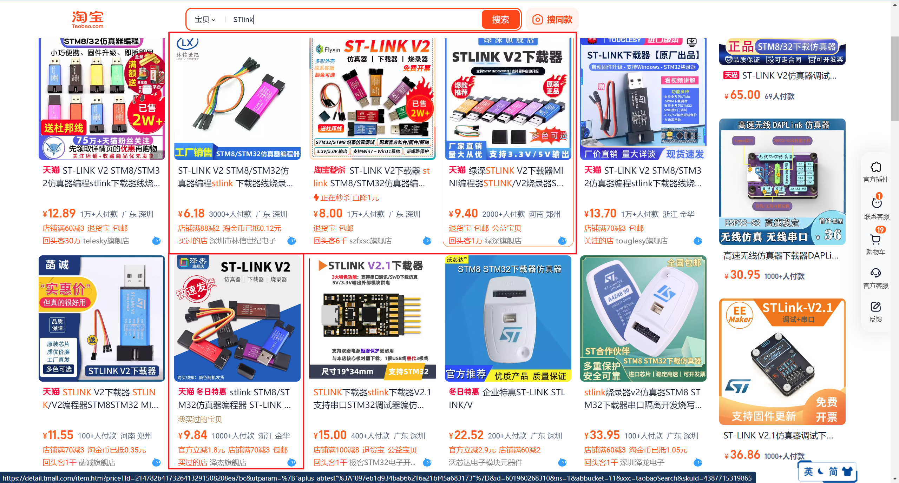

#### JLink OB

JLINK不用看的 死贵，可以选择JLINK OB。（平  替）

这个可以通用JLINK驱动，过JLINK检测，可以使用Ozone等调试软件（主要就是用Ozone），不过你们入门学习倒也用不到。

#### DAP-LINK

一般DAP-LINK都是用无线版的，调试比较方便。（图中是我们调试机器人时所使用的）

------

### 买那个呢

综上，你们可以用STLINK 或者 JLINK OB 。（还是用STLINK吧）

# 软件

先贴一个安装教程视频在此：https://www.bilibili.com/video/BV19V411g7gD

时间很长很详细，安装部分可以看  21:00 ~ 37:09 。 其他的安装VS Code 以及配置 MinGW等可以先不使用。

***提示：安装目录中一定不要存在中文！！！***

***如果你下载速度很慢，请告知我，我会提供安装包。***

*** Keil注册机 、 STM32F103的芯片包 以及 V5编译器ARMCC 我会提供。***  

有了视频底下的文字似乎没什么用途，,,,,emmm

## Keil5

​	虽然它的UI界面很丑，但是无可置疑的是KEIL是嵌入式开发软件里的元老级软件，***主要还是因为它的Debug功能非常强大。***

​	虽然ST公司开发了适用于STM32的集成开发环境 STM32CubeIDE，TI公司也开发了专用于TI芯片的CCSTUDIO-THEIA，但是KEIL除了STM32，TI，已可以用于开发51以及众多国产芯片，不用去熟悉那么多不同的IDE。  所以咱还是讲KEIL咯。

### 下载

下载页面：https://www.keil.com/download/product/

------

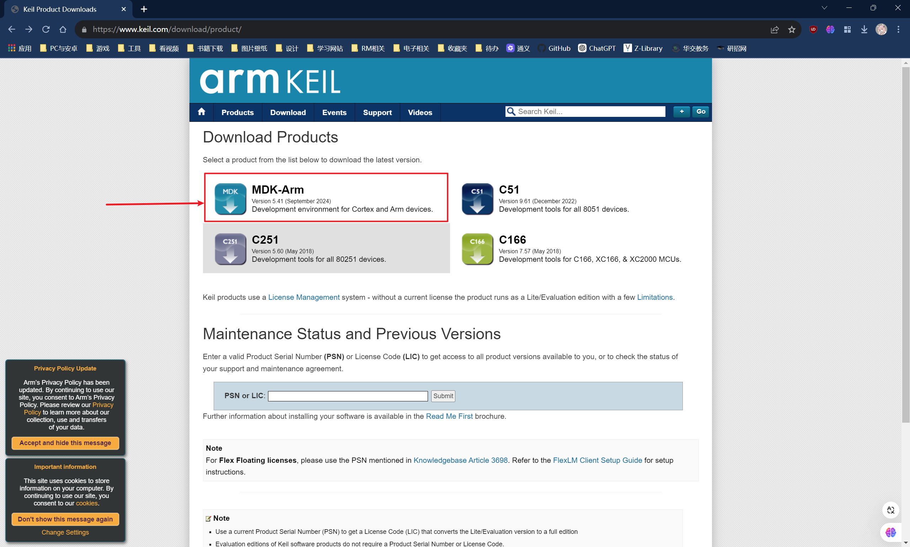

我们要下载左上方的 MDK-Arm （当前版本号5.41，2024年9月更新）。

点进去之后会让你输入个人信息。随便写就可以。写完点下方的Submit提交之后就可以下载安装包。

安装包大约850MB。

***（如果你们下载速度很慢的话请告知我，我会上传安装包。）***

*** 注册机 以及 STM32F103的芯片包 以及 V5编译器ARMCC 我会提供。***  

后续安装过程可以看文件最上方视频 。

## STM32CubeMX

图形化配置STM32引脚的工具，使用HAL库 (硬件抽象层)。CubeMX依赖于JAVA运行环境，不过CubeMX安装时候应该是帮你一起安装了。如果没有的话就自己安装JRE。

下载页面：https://www.st.com.cn/content/st_com/zh/stm32cubemx.html

点击下载即可。

------

------

之后会让你创建账户。***这个还是创建一下，到时候在软件里也要登录才能使用。***

------

安装包大小约600MB。解压安装即可。

***如果你下载速度很慢，请告知我，我会提供安装包。但是一定要去注册MyST账号。***

软件第一次启动似乎会卡死，是一个小bug。打开任务管理器关闭open JDK platform binary 即可。

# 上链接

## 焊接需要用到的小工具

### 焊枪、焊锡丝

鹿仙子、安立信、德力西什么的都可以。十几块的内热式可调温的就可以，焊锡丝一定要记得自己买。

***记得一定要自己买焊锡丝，一定不要用买焊枪送的那种焊锡丝，谁用谁说好。***

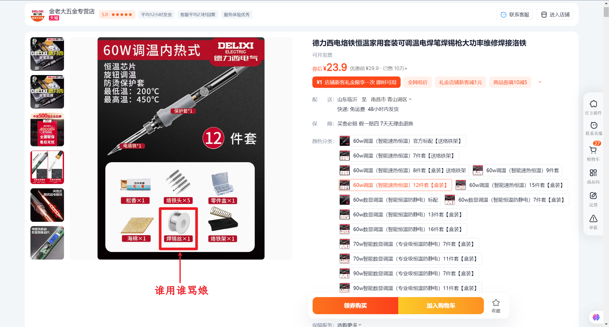

------

### 烙铁头

不同的烙铁头用来焊接不同的场景。可以自行搜索应用场景。

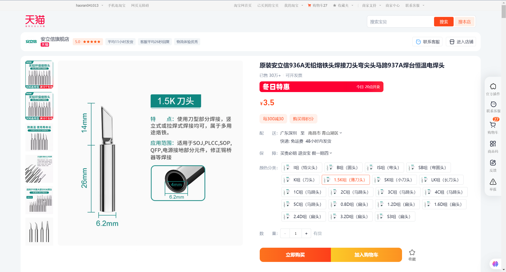

### 烙铁架

买烙铁送的烙铁架也能用，不过挺轻的，有时候容易倾倒，小心烫伤。（又不是不能用）

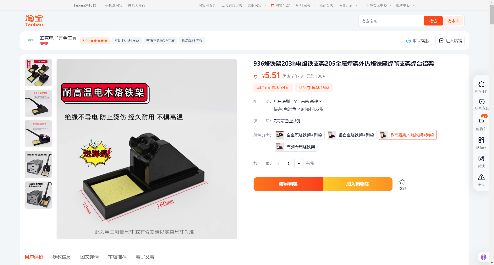

### 水口钳

插件元件焊接之后需要剪短多余的引脚。

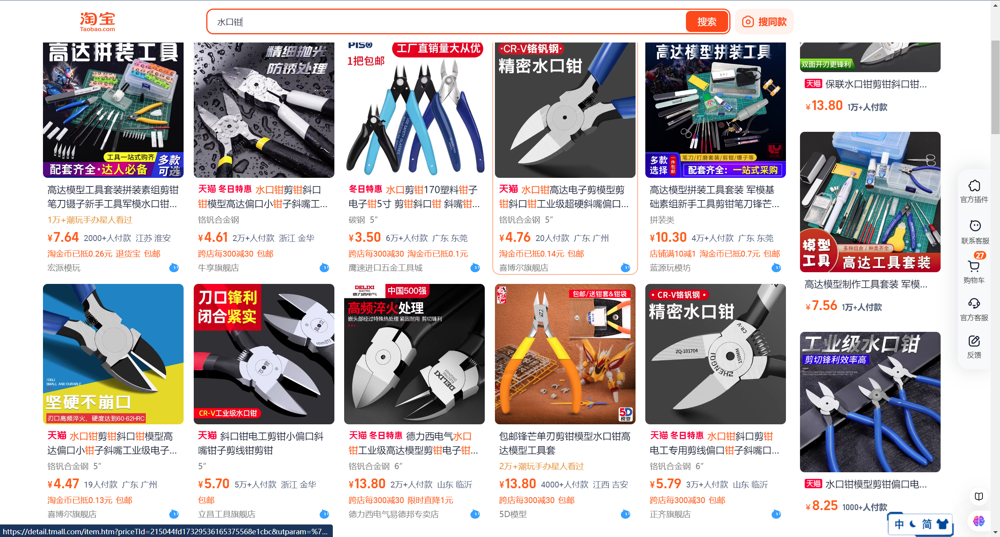

### 吸锡器/吸锡带

焊接如果有问题可以用吸锡带吸走多余的锡。

------

## 常用模块

### 面包板

可以将传感器以及单片机插到面包板上通过杜邦线链接进行简单的测试。

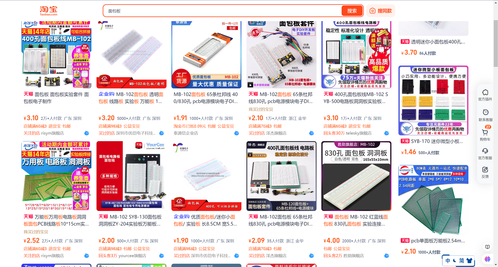

### 杜邦线

根据接口不同分为公对公、母对母以及公对母的接口线。

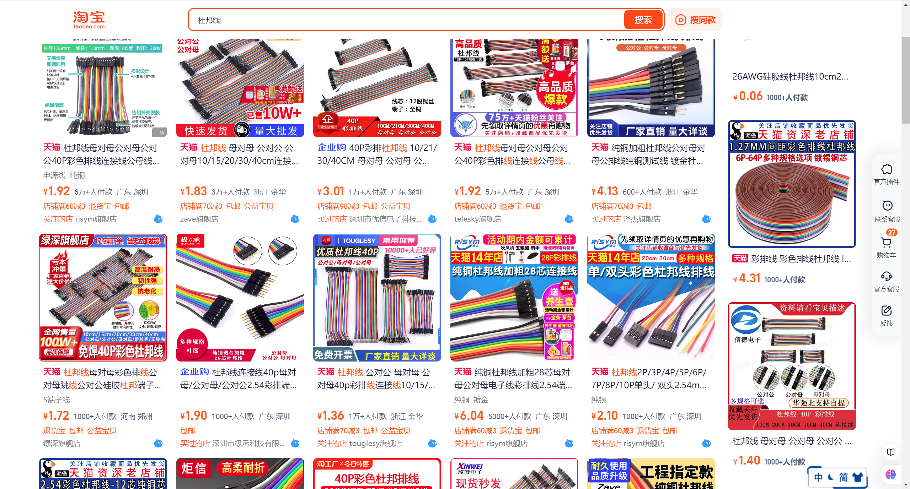

### 洞洞板

可以用做焊接练习以及测试操作。（可以在立创嫖到开源的。慎嫖）

很显然我们说的不是贴墙上的那种。。。

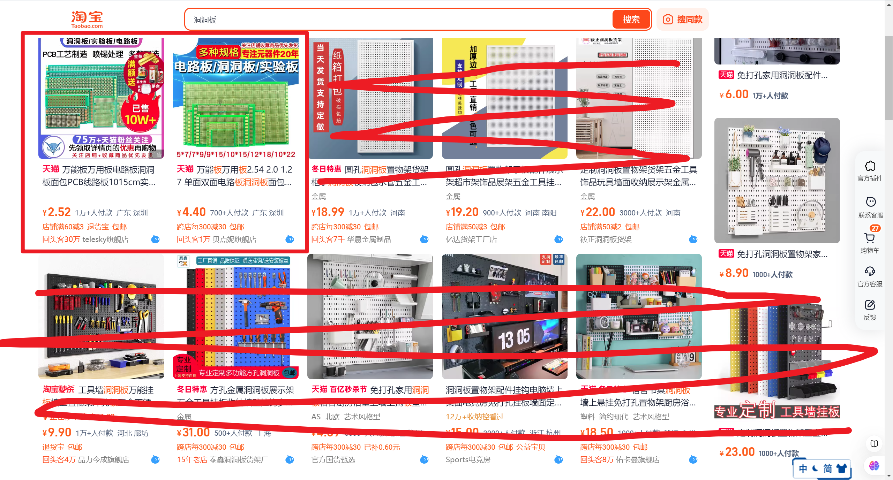

### 电源模块

降压模块，如果你要外接供电需要通过降压将电压降到单片机可以容忍的范围之后才能供给单片机。

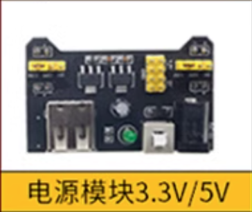

### 电机驱动模块

用于控制电机。常用的有L298N、TB6612等。初学用L298N即可。

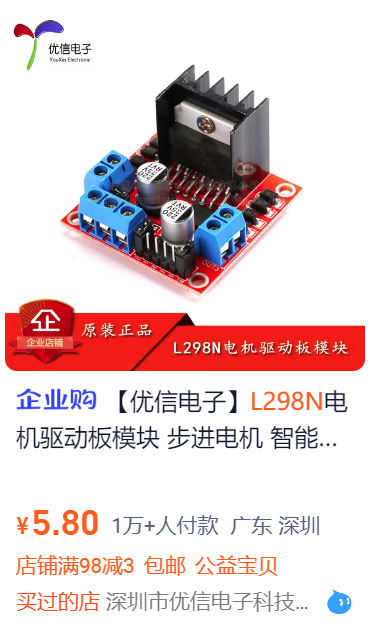

### 一些杂七杂八

比如发光二极管（成为点灯大师第一步）、小电机、舵机等输出设备。

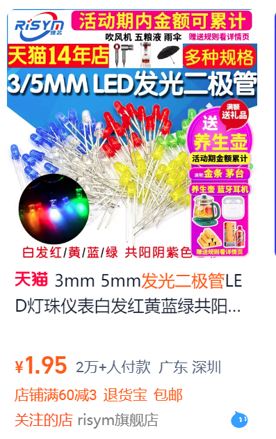

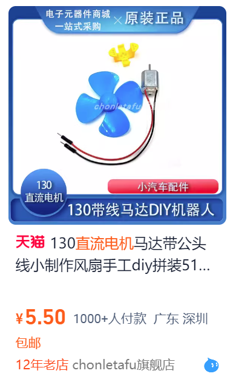

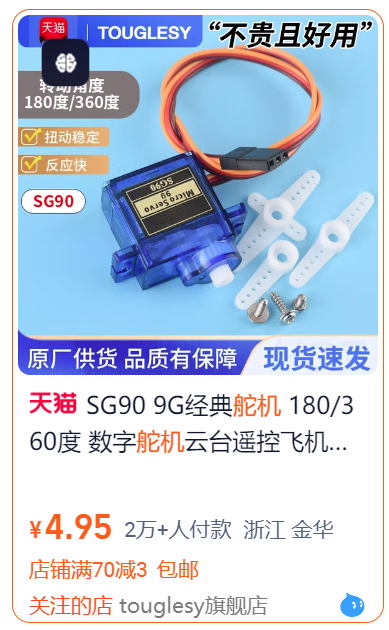

### 传感器

传感器有很多种，淘宝上也有很多这种套件，不过我们很多其实都用不到 / 使用方法大同小异，教学时候只用学会几种即可，其他的一通百通。

#### HC-SR04超声波模块

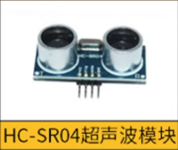

#### 蓝牙模块

蓝牙模块挺多种的，JDY-31、HC-05、HC-06巴拉巴拉的，找个便宜的。

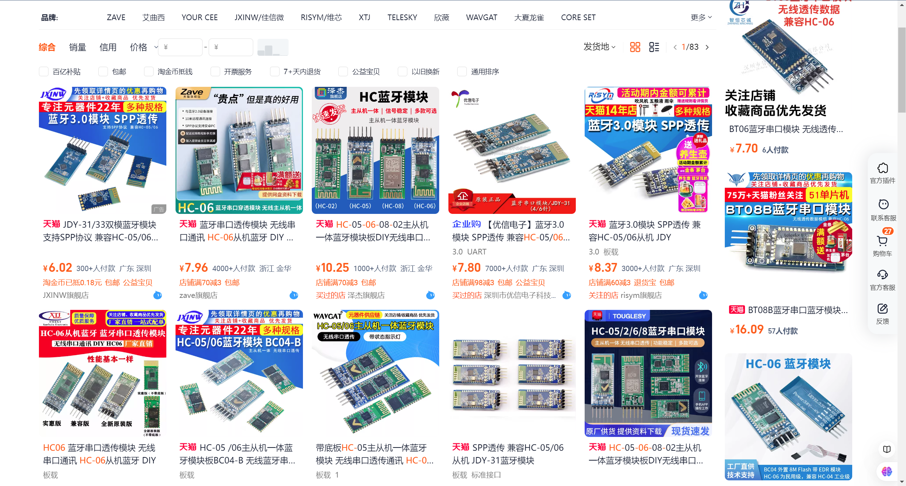

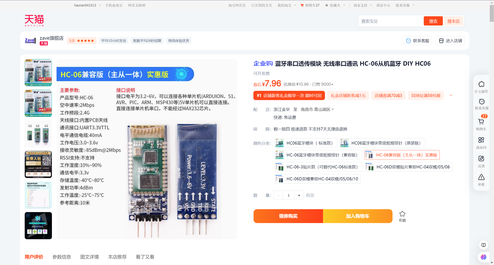

#### DHT11温湿度模块

#### 旋转编码器

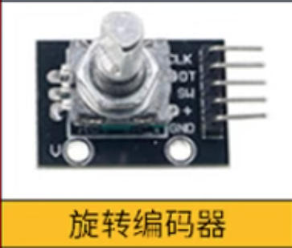

#### 摇杆传感器

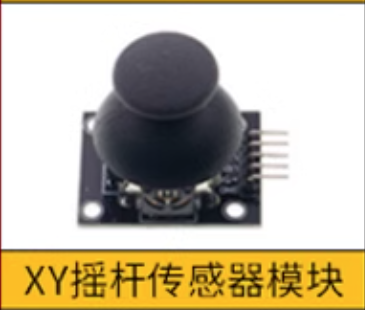

#### 陀螺仪

陀螺仪根据实际应用有很多种，这个是一个重点学习内容。我们初学使用MPU-6050即可。

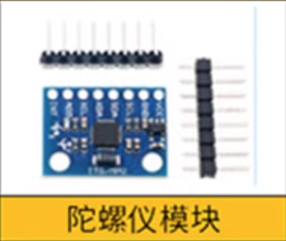

## 小任务么(先不急)

可以做一个机械臂小车，用手机通过蓝牙控制小车的行进以及机械臂操作。

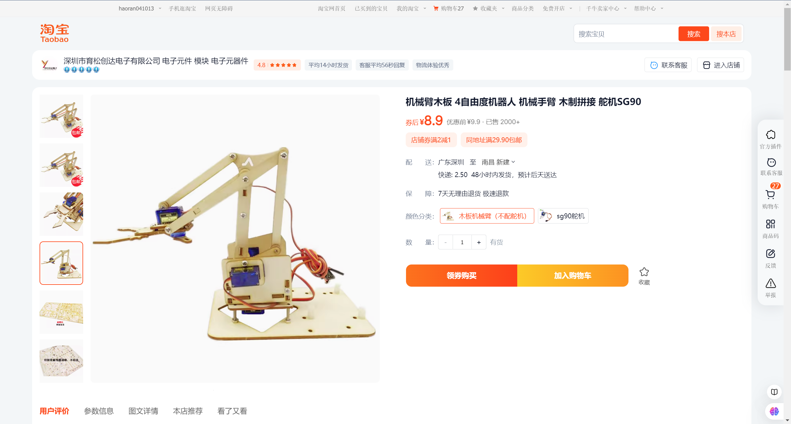

需要四个舵机驱动机械臂。

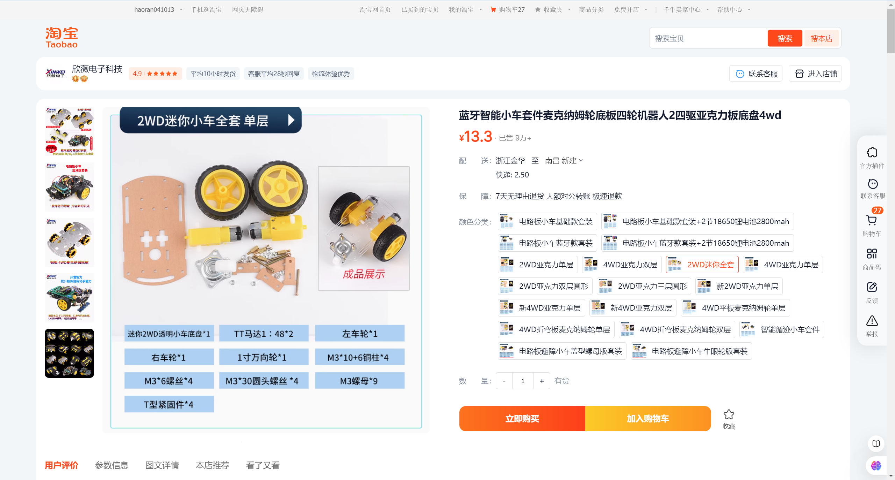

小车底盘什么样的都无所谓。
